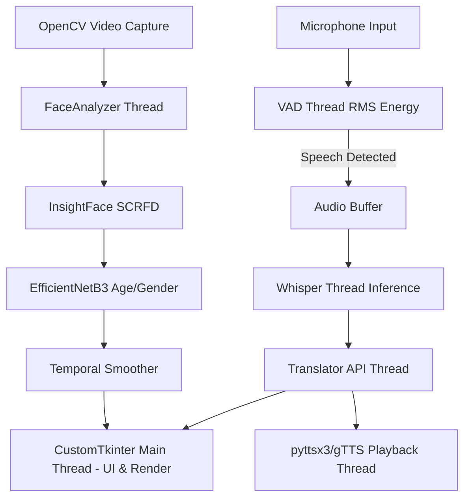

# ARCHITECTURE & ENGINEERING WHITEPAPER
## Detector N Translator: Real-Time Multimodal AI Pipeline
**Level:** Advanced / System Architecture Deep-Dive

---

## Table of Contents
1. [Executive Summary & System Architecture](#1-executive-summary--system-architecture)
2. [Concurrency, Threading, and the Python GIL](#2-concurrency-threading-and-the-python-gil)
3. [Computer Vision Pipeline: SCRFD & Temporal Smoothing](#3-computer-vision-pipeline-scrfd--temporal-smoothing)
4. [Custom Deep Learning: EfficientNet & Multi-Task Learning](#4-custom-deep-learning-efficientnet--multi-task-learning)
5. [Digital Signal Processing & Voice Activity Detection (VAD)](#5-digital-signal-processing--voice-activity-detection-vad)
6. [Automatic Speech Recognition (ASR): Transformer Theory](#6-automatic-speech-recognition-asr-transformer-theory)
7. [Software Engineering: Resiliency & Design Patterns](#7-software-engineering-resiliency--design-patterns)
8. [Extensibility & Alternative Industry Applications](#8-extensibility--alternative-industry-applications)

---

## 1. Executive Summary & System Architecture

The "Detector N Translator" is a complex, real-time multimodal application bridging Computer Vision (CV) and Natural Language Processing (NLP). At its core, it aims to solve a highly asynchronous problem: processing 30 frames per second (FPS) of high-resolution video while simultaneously capturing 16kHz audio, detecting human speech, running massive Transformer-based transcriptions, and rendering a hardware-accelerated GUI—all on consumer-grade hardware without frame drops.

### The Asynchronous Bottleneck
Traditional applications run sequentially. If an application waits for a 200ms API call to translate text, a 30 FPS video feed will drop 6 frames, causing visible stuttering. To resolve this, the system implements a strict decoupling of I/O, heavy compute, and UI rendering.

### System Diagram


---

## 2. Concurrency, Threading, and the Python GIL

Python utilizes a Global Interpreter Lock (GIL), meaning only one thread can execute Python bytecode at a time. This makes multi-threading in Python notoriously difficult for CPU-bound tasks.

### Why Threading Works Here
Despite the GIL, this architecture heavily utilizes `threading.Thread`. Why? Because the heavy lifting is NOT done in Python bytecode. 
1. **OpenCV (`cv2.VideoCapture`)** is written in C++ and releases the GIL during frame fetching.
2. **InsightFace (ONNXRuntime)** is written in C++ and releases the GIL during matrix multiplication.
3. **Sounddevice / Pygame** interface directly with C-level ALSA/DirectSound APIs, bypassing the GIL.

By utilizing Python threads as "orchestrators" rather than "computational workers", we achieve true concurrency.

### Daemon Threads
Background workers (Webcam, VAD) are spawned with `daemon=True`. This is a critical OS-level design choice. A daemon thread relies on the main thread's lifecycle. When the CustomTkinter UI is closed, the OS abruptly reclaims the daemon threads' memory, preventing background processes from "zombifying" and locking the webcam or microphone resources.

---

## 3. Computer Vision Pipeline: SCRFD & Temporal Smoothing

### Face Detection: The SCRFD Architecture
We utilize **SCRFD** (Sample and Computation Redistribution for Efficient Face Detection) via the InsightFace library. Older methods like Haar Cascades rely on contrast gradients, which fail in low light or at odd angles. SCRFD is a Single-Stage CNN.

**Feature Pyramid Networks (FPN):**
SCRFD passes the image through a ResNet backbone, extracting feature maps at different scales (e.g., 32x32, 16x16, 8x8). This allows the network to detect faces that are massive (close to camera) and tiny (far away) simultaneously. 

**Anchor Boxes & NMS:**
The model predicts thousands of bounding boxes. It utilizes **Non-Maximum Suppression (NMS)**. NMS calculates the Intersection over Union (IoU) of overlapping bounding boxes.
`IoU = Area of Overlap / Area of Union`
If IoU > 0.4, the box with the lower confidence score is discarded, leaving only one tight bounding box per face.

### Mathematical Temporal Smoothing (The Anti-Flicker)
Raw neural network outputs fluctuate. A face detected at `(100, 100)` in Frame 1 might be detected at `(102, 99)` in Frame 2 due to sensor noise, causing visual jitter.

To solve this, we implemented an **Exponential Moving Average (EMA)** for bounding box coordinates:
$$ EMA_{t} = lpha \cdot Value_t + (1 - lpha) \cdot EMA_{t-1} $$
Where $lpha$ (the smoothing factor) is dynamically calculated based on the distance between the old and new coordinates. If the distance is massive (the person moved rapidly), $lpha 
ightarrow 1$ (trust new value). If the distance is tiny (sensor noise), $lpha 
ightarrow 0.1$ (trust old value).

For Age, we use a simple Rolling Moving Average (SMA) queue of size 15.
For Gender, we use a Mode (Majority Vote) over a temporal window to prevent a face rapidly flashing between Male and Female during head turns.

---

## 4. Custom Deep Learning: EfficientNet & Multi-Task Learning

The default OpenCV DNN age model is severely biased toward Caucasian faces and categorizes age into rigid buckets. To solve this, a custom Deep Learning model was engineered.

### EfficientNetB3 and Compound Scaling
Convolutional Neural Networks (CNNs) are typically scaled up in one of three ways:
1. **Depth:** Adding more layers (e.g., ResNet-18 to ResNet-152).
2. **Width:** Adding more channels per layer.
3. **Resolution:** Feeding larger images (e.g., 224x224 to 260x260).

EfficientNet introduces **Compound Scaling**. It mathematically balances depth, width, and resolution using a constant ratio $\phi$. This allows EfficientNetB3 to achieve 81.6% ImageNet accuracy with a fraction of the parameters of older models, making it feasible to run on a CPU in real-time.

### Multi-Task Learning (The Dual-Head Architecture)
The custom model uses a Dual-Head topology. Instead of just predicting Age, it predicts *Age* and *Age Group*.

**1. Regression Head (L1 Loss)**
Predicts continuous age (e.g., 22.4 years). We use L1 Loss (Mean Absolute Error) instead of Mean Squared Error (MSE) because MSE heavily penalizes outliers. If the model guesses 60 for a 20-year-old, MSE squares the error ($40^2 = 1600$), forcing the model to skew its weights drastically. L1 is robust to outliers.

**2. Classification Head (Weighted Cross-Entropy Loss)**
Predicts the bracket (Teen, Adult). We apply a class weight penalty vector:
$$ W = [1.0, 4.0, 1.0, 3.0, 2.0] $$
The model is penalized 4x more for misclassifying a Teen compared to a Child. This forces the gradient descent algorithm to focus heavily on the boundaries of difficult classes.

By backpropagating the sum of both losses ($L_{total} = L1 + \lambda L_{CE}$), the shared EfficientNet backbone learns richer, more generalized facial features than it would learning either task alone.

### Domain Adaptation via Oversampling
To ensure high accuracy on Indian demographics, the UTKFace dataset was manually rebalanced. Data points with `race=3 (Indian)` were oversampled by a factor of 3. This shifts the internal distribution of the model's training data, forcing the weights to optimize for the melanin levels, facial structures, and lighting conditions typical of the target demographic.

---

## 5. Digital Signal Processing & Voice Activity Detection (VAD)

To prevent the heavy Whisper model from running constantly on background noise, we implemented a deterministic Voice Activity Detector using Digital Signal Processing (DSP).

### Audio Capture & Nyquist Theorem
Audio is captured at **16,000 Hz (16 kHz)**. According to the Nyquist-Shannon sampling theorem, a sample rate of $f_s$ can accurately represent frequencies up to $f_s / 2$. Therefore, 16 kHz captures up to 8 kHz of audio bandwidth. Human speech intelligibility is almost entirely contained between 300 Hz and 4000 Hz, making 16 kHz the optimal, compute-efficient rate for Speech Recognition.

### Root Mean Square (RMS) Energy Tracking
Every 100ms, the system grabs an audio chunk and calculates the RMS:
$$ RMS = \sqrt{rac{1}{N} \sum_{i=1}^{N} x_i^2} $$
Where $x_i$ is the amplitude of the audio waveform at sample $i$. RMS represents the perceived "loudness" of the signal. 
* If $RMS > 	ext{Threshold}$, the VAD state machine transitions to `LISTENING`.
* If $RMS < 	ext{Threshold}$ for continuous $T$ seconds, the state machine triggers a `FLUSH`, sending the accumulated buffer to the transcription thread.

---

## 6. Automatic Speech Recognition (ASR): Transformer Theory

Once audio is captured, it is passed to OpenAI's Whisper (Small).

### 1. Mel-Spectrogram Conversion
Raw 1D audio waveforms are mathematically difficult for neural networks to process. The audio is converted into a 2D image-like representation called a **Mel-Spectrogram** using the Short-Time Fourier Transform (STFT). The "Mel" scale is logarithmic, mimicking how the human ear perceives frequency differences (we easily distinguish 100Hz from 200Hz, but cannot distinguish 10,000Hz from 10,100Hz).

### 2. The Transformer Encoder-Decoder
The Mel-spectrogram is sliced into chunks and passed through a Transformer architecture.
*   **Positional Encoding:** Because Transformers process all chunks in parallel (unlike older RNNs which read left-to-right), sine/cosine waves are added to the input embeddings so the network knows the "time order" of the sounds.
*   **Self-Attention:** The model learns which parts of the audio relate to others. It can look at the end of a sentence to figure out a muffled word at the beginning of the sentence.
*   **Multilingual Zero-Shot:** Whisper was trained on 680,000 hours of noisy, real-world data. It predicts the language token (e.g., `<|te|>` for Telugu) internally before predicting the text, allowing seamless, on-the-fly language switching without reconfiguring the model.

---

## 7. Software Engineering: Resiliency & Design Patterns

### The Chain of Responsibility Pattern
Translation APIs are notoriously fragile due to rate limits. The `Translator` module implements the **Chain of Responsibility** design pattern. 

```python
# Conceptual Architecture
def translate(text):
    try:
        return GoogleTranslator().execute(text)
    except RateLimitError:
        try:
            return MyMemoryTranslator().execute(text)
        except NetworkError:
            return PonsTranslator().execute(text)
```
This guarantees system availability (High Availability design). If Google blocks the IP for scraping, the user experiences zero downtime as the payload silently cascades to MyMemory.

### Event-Driven UI (CustomTkinter)
The UI operates on an Event Loop. The `self.after(33, _update_webcam)` method schedules the webcam update every 33 milliseconds (~30 FPS) on the event queue. If we were to use `time.sleep()`, the entire OS-level window manager would mark the application as "Not Responding".

---

## 8. Extensibility & Alternative Industry Applications

The architecture built for "Detector N Translator" is highly modular. The pipeline `(Sensor Input -> DSP/CV -> Deep Learning Inference -> Actuator Output)` can be repurposed for various industries:

### A. Retail & Smart Kiosks
*   **Current:** Translates speech and detects age.
*   **Adaptation:** Mount on a retail kiosk. Use age/gender detection to serve targeted advertisements on the screen. Use the VAD and Whisper models to allow users to ask the kiosk questions (e.g., "Where are the shoes?") in native Indian languages.

### B. Security & Surveillance (Expansion of SecureLens)
*   **Current:** Single camera, single face.
*   **Adaptation:** Integrate a Multi-Object Tracker (like DeepSORT or ByteTrack). Feed rtsp IP-camera streams. The system can track multiple individuals, log their age/gender demographics to a cloud database, and trigger audio alerts (via TTS) if unauthorized demographics enter a restricted zone.

### C. Accessibility Tools
*   **Current:** Displays text on a desktop.
*   **Adaptation:** Port the Python logic to an edge device (like a Raspberry Pi 5). Attach it to smart glasses. The VAD and translation pipeline can provide real-time subtitles on an AR display for deaf or hard-of-hearing individuals interacting with foreign language speakers.

### D. Automated Customer Support (Voice Bots)
*   **Current:** Push to talk or VAD.
*   **Adaptation:** Connect the output of the Translator module to a Large Language Model (like LLaMA 3 or Gemini). 
    `Audio -> Whisper -> Translated Text -> LLM Inference -> Response Text -> Translation -> TTS -> Audio`. 
    This creates a fully autonomous, real-time voice agent capable of conducting phone interviews or customer support in 11+ regional languages.

---
*Authored for Technical Review and Portfolio Demonstration.*
